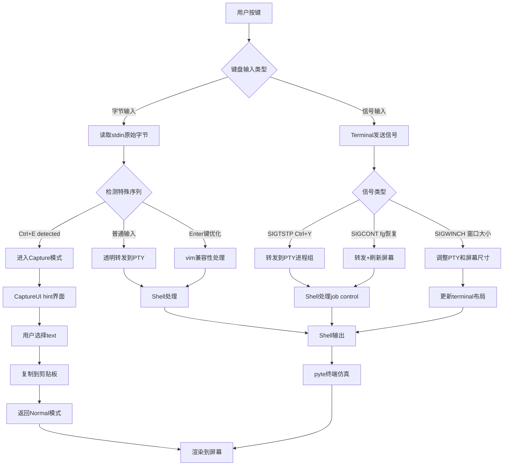
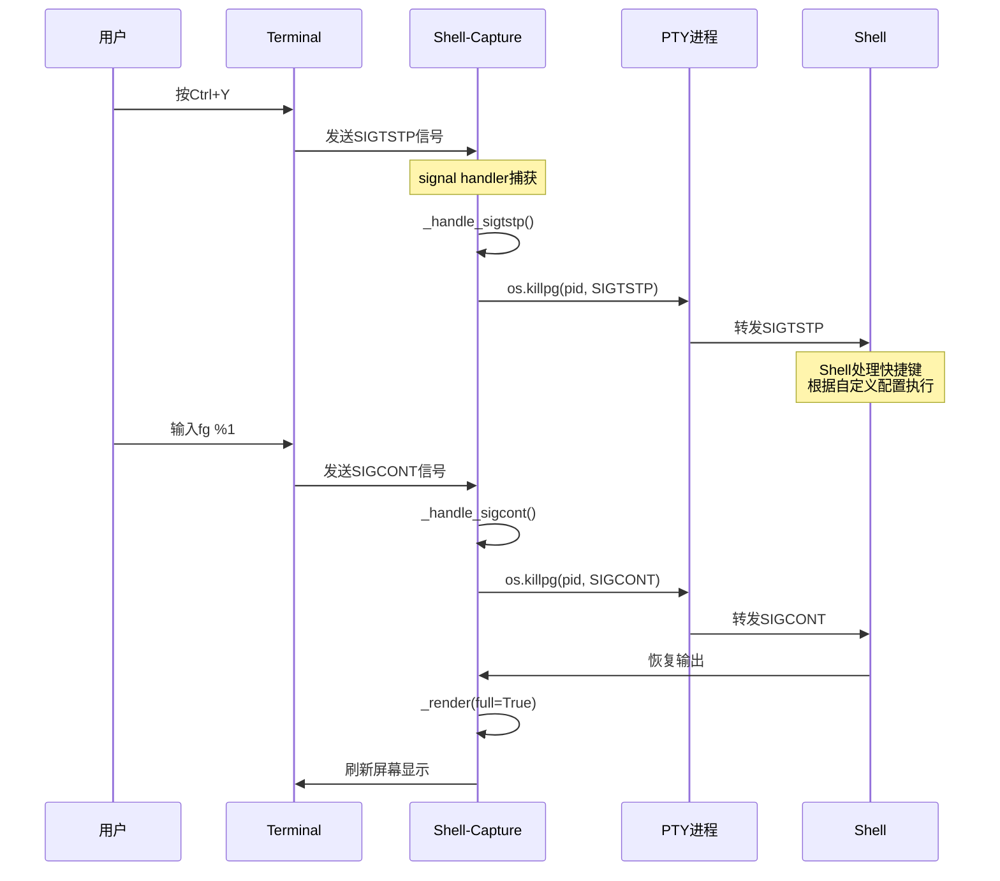

# Shell-Capture 设计文档

## 🎯 项目概述

**Shell-Capture** 是一个极简的单文件终端wrapper工具，旨在提供类似tmux的单面板体验，专门为capture操作优化。它通过透明代理shell进程，在用户按下快捷键时提供强大的文本选择和复制功能。

**设计理念**: 
- **单文件极简**: 就像tmux-capture一样，整个功能打包在一个可执行文件中
- **零配置**: 开箱即用，无需复杂设置
- **最小依赖**: 只依赖Python标准库 + blessed + ptyprocess + pyte
- **真实终端仿真**: 使用pyte库提供完整的终端仿真支持

## 🏗️ 架构设计

### 核心理念
- **透明代理**: 99%的时间用户感觉不到wrapper存在
- **快捷键触发**: 全局快捷键（如Ctrl+E）触发capture模式
- **极简设计**: 专注于capture功能，不做复杂的终端复用

### 系统架构图

```
┌─────────────────────────────────────────────────────────────┐
│                 Shell-Capture Wrapper                      │
├─────────────────────────────────────────────────────────────┤
│  ┌─────────────────────────────────────────────────────────┐│
│  │                   PTY Layer                             ││
│  │  ┌─────────────────────────────────────────────────────┐││
│  │  │        Shell Process (bash/zsh/fish)               │││
│  │  │  ┌─────────────────────────────────────────────────┐│││
│  │  │  │    Optional: tmux/vim/any command               ││││
│  │  │  └─────────────────────────────────────────────────┘│││
│  │  └─────────────────────────────────────────────────────┘││
│  └─────────────────────────────────────────────────────────┘│
├─────────────────────────────────────────────────────────────┤
│                     功能模块                                │
│  • I/O 透明转发 (Normal Mode)                              │
│  • 快捷键检测 (Ctrl+E)                                     │
│  • 屏幕内容缓冲                                            │
│  • 模式匹配引擎 (复用tmux-capture代码)                      │
│  • Hint生成系统 (复用tmux-capture代码)                      │
│  • 交互式选择界面 (复用tmux-capture代码)                    │
│  • 剪贴板操作                                              │
└─────────────────────────────────────────────────────────────┘
```

## 🔧 技术实现方案

### 1. PTY管理 (伪终端)
- **库选择**: `ptyprocess` (经过测试验证)
- **功能**: 创建伪终端，管理shell进程生命周期
- **责任**: 
  - 启动目标shell (bash/zsh/fish)
  - 处理终端大小变化 (SIGWINCH)
  - 管理进程信号传递
  - 配置详细的termios属性用于vim兼容性
  - 设置环境变量 (TERM=xterm-256color, COLORTERM=truecolor)

### 2. I/O透明转发
- **Normal Mode**: 双向透明传递stdin/stdout
- **性能要求**: 延迟 < 1ms，无感知代理
- **实现**: select-based I/O多路复用，避免阻塞
- **优化**: 针对vim的Enter键处理优化 (LF->CR转换)

### 3. 用户按键和信号处理
- **触发键**: Ctrl+E (可配置)
- **检测方式**: 监听原始键盘输入
- **状态切换**: Normal Mode ↔ Capture Mode
- **信号处理**: 透明转发job control信号 (SIGTSTP/SIGCONT)

### 4. 屏幕内容缓冲
- **缓冲策略**: pyte终端仿真，完整的2D屏幕缓冲
- **内容处理**: 实时解析ANSI转义序列，维护字符属性
- **终端仿真**: 支持光标控制、颜色、替代屏幕等完整VT100+功能
- **历史缓冲**: HistoryScreen提供1000行滚动回看
- **优化**: 脏行检测，只刷新变化的屏幕区域

### 5. 模式匹配与Hint系统 (已实现)
- **复用来源**: tmux-capture项目现有代码
- **核心组件**:
  - `REGEX_PATTERNS`: URL/文件路径/Git提交/邮箱模式
  - `CaptureUI._find_matches()`: 文本匹配引擎
  - `generate_hints()`: vim友好的hint生成算法
  - `CaptureUI.run()`: 交互式hint选择界面
  - `ColorConfig`: Gruvbox主题配置
- **特性增强**:
  - 相同内容使用相同hint (减少认知负荷)
  - 24位真彩色支持
  - 渐进式输入 (a -> as -> asd)
  - 智能hint分配算法

## 📁 项目结构

```
shell-capture/
├── DESIGN.md                  # 本设计文档  
├── shell-capture              # 单文件主程序 (类似tmux-capture)
└── README.md                  # 简要使用说明
```

**单文件架构优势**:
- **部署简单**: 一个文件搞定，uv自动安装依赖
- **维护容易**: 所有逻辑在一处，便于理解和修改
- **复用高效**: 集成tmux-capture成熟的模式匹配和UI代码
- **分发便利**: uv script形式，跨平台兼容
- **开发便利**: 详细的debug.log帮助问题诊断

## 🚀 实现路径

### Phase 1: 单文件框架搭建 (MVP)
- [x] 创建设计文档
- [x] 搭建单文件基础结构 (uv script形式)
- [x] 实现基础PTY管理 (ptyprocess)
- [x] 实现I/O透明转发 (select-based)

### Phase 2: 快捷键检测
- [x] 在I/O流中检测Ctrl+E
- [x] 实现Normal/Capture模式切换
- [x] 添加屏幕内容缓冲机制

### Phase 3: 复用Capture核心
- [x] 从tmux-capture复制模式匹配代码
- [x] 从tmux-capture复制hint生成代码
- [x] 从tmux-capture复制blessed UI代码
- [x] 修改内容源从tmux改为内存缓冲

### Phase 4: 集成测试
- [x] 基础功能测试
- [x] 性能优化 (I/O延迟)
- [x] 错误处理完善
- [x] Vim兼容性优化

### Phase 5: 高级功能 (已实现)
- [x] pyte终端仿真引擎集成
- [x] 真彩色(24-bit)支持
- [x] 替代屏幕缓冲区支持 (vim模式)
- [x] Gruvbox主题集成
- [x] 详细的调试日志系统
- [x] 信号处理 (SIGWINCH, SIGTSTP, SIGCONT)
- [x] Monkey patch修复vim兼容性问题

## 🎮 用户体验设计

### 启动方式
```bash
# uv script形式，自动安装依赖
./shell-capture

# 启动指定shell
./shell-capture bash
./shell-capture zsh

# 在wrapper中运行复杂命令
./shell-capture tmux
./shell-capture "ssh user@host"
./shell-capture vim

# 支持任何复杂命令
./shell-capture "python -m http.server"
```

### 使用流程
1. **启动wrapper**: `shell-capture`
2. **正常使用**: 透明体验，就像直接使用shell
3. **触发capture**: 按Ctrl+E
4. **选择文本**: 使用hint系统选择
5. **复制**: 自动复制到剪贴板
6. **返回**: 自动返回正常模式

## 🔧 技术细节

### 用户按键处理流程

用户按键在shell-capture中经历了复杂的处理流程，需要区分普通字符输入、控制字符和信号：



### ANSI序列和信号处理详解

#### 1. 字节级输入处理
```python
# 检测原始字节输入
user_input = os.read(sys.stdin.fileno(), 1024)

# 特殊序列检测
if CAPTURE_HOTKEY in user_input:  # b'\x05' (Ctrl+E)
    self._enter_capture_mode()
elif user_input in (b"\n", b"\r", b"\r\n"):  # Enter键处理
    if self.in_alt_screen:  # vim模式优化
        processed_input = b"\r"  # LF -> CR 转换
    self.pty_process.write(processed_input)
```

#### 2. 信号级处理流程


#### 3. 信号优先级设计

**为什么shell快捷键优先级更高？**

1. **Signal Forwarding**: shell-capture不处理job control信号，而是透明转发
2. **Process Group**: 使用`os.killpg()`确保信号到达整个进程组
3. **No Self-Suspension**: shell-capture自身不挂起，保持UI响应

```python
def _handle_sigtstp(self, signum, frame):
    """透明转发SIGTSTP给shell处理"""
    if self.pty_process and self.pty_process.isalive():
        # 转发给PTY进程组，让shell按其配置处理
        os.killpg(self.pty_process.pid, signal.SIGTSTP)
    # shell-capture自身不挂起，继续维护UI
```

### 快捷键检测实现
```python
# 实际实现代码
def _main_loop(self):
    while self.pty_process.isalive():
        readable, _, _ = select.select([sys.stdin, pty_fd], [], [], 0.01)
        
        if sys.stdin in readable:
            user_input = os.read(sys.stdin.fileno(), 1024)
            
            # 检测capture热键 (Ctrl+E)
            if CAPTURE_HOTKEY in user_input:  # b'\x05'
                self._enter_capture_mode()
            else:
                # 透明转发到shell (含vim Enter键优化)
                self.pty_process.write(user_input)
```

### I/O代理实现
```python
# 实际实现代码 (select-based, 非async)
def _main_loop(self):
    while self.pty_process.isalive():
        # 使用select进行非阻塞I/O
        readable, _, _ = select.select([sys.stdin, pty_fd], [], [], 0.01)
        
        # 处理用户输入
        if sys.stdin in readable:
            user_input = os.read(sys.stdin.fileno(), 1024)
            if CAPTURE_HOTKEY in user_input:
                self._enter_capture_mode()  # 启动hint界面
            else:
                self.pty_process.write(user_input)
        
        # 处理shell输出
        if pty_fd in readable:
            pty_output = self.pty_process.read()
            decoded_output = pty_output.decode('utf-8', 'replace')
            
            # 检测替代屏幕缓冲区切换 (vim模式)
            self._handle_alt_screen_sequences(decoded_output)
            
            # 喂给pyte进行终端仿真
            self.pyte_stream.feed(decoded_output)
            
            # 渲染到物理终端
            self._render()
```

### 屏幕缓冲策略 (已实现)
- **pyte终端仿真**: 完整的2D屏幕缓冲区
- **历史缓冲**: HistoryScreen提供1000行滚动回看
- **实时渲染**: 脏行检测，只渲染变化的区域
- **ANSI处理**: 完整的VT100+转义序列支持
- **替代屏幕**: 支持vim等应用的替代屏幕缓冲区
- **字符属性**: 维护每个字符的颜色、样式属性
- **内存优化**: 自动脏行清理，避免内存泄漏

## 🎯 优势与特色

### 相比tmux-capture
- **独立性**: 不依赖tmux
- **通用性**: 支持任何shell和终端
- **简洁性**: 专注capture功能

### 相比其他工具
- **透明性**: 用户无感知代理
- **智能性**: 高级模式匹配
- **效率性**: 优化的hint系统

## 🤔 技术挑战与解决方案

### 1. I/O延迟问题
- **挑战**: 代理可能引入延迟
- **解决**: 异步I/O + 优化缓冲

### 2. 终端兼容性
- **挑战**: 不同终端的特殊处理
- **解决**: 广泛测试 + 降级方案

### 3. 信号处理 (已解决)
- **挑战**: 正确传递终端信号，保证shell快捷键优先级
- **解决**: 透明信号转发机制，使用进程组转发确保shell处理job control

### 4. 内存管理
- **挑战**: 长时间运行的内存积累
- **解决**: 滚动缓冲 + 智能清理

## 🔮 未来扩展可能性

### 短期扩展
- [x] 多种快捷键支持 (当前Ctrl+E)
- [ ] 配置文件系统 (TOML/JSON)
- [x] 主题定制 (Gruvbox已实现)
- [ ] 自定义模式匹配规则

### 长期扩展 
- [ ] 多面板支持 (类tmux)
- [ ] 会话管理和恢复
- [ ] 插件系统
- [ ] 网络透明访问 (SSH integration)
- [ ] 记录和回放功能
- [ ] AI辅助命令建议

### 性能优化空间
- [ ] C extension加速关键路径
- [ ] 更高效的屏幕差分算法
- [ ] GPU加速的文本渲染

## 📚 参考与灵感

- **tmux-capture**: 模式匹配和hint系统的成熟实现
- **tmux**: 终端复用的设计理念 
- **neovim**: 终端控制的最佳实践
- **iTerm2**: 快捷键和选择体验
- **pyte**: 终端仿真核心引擎
- **blessed**: 跨平台终端控制库
- **Gruvbox**: 配色主题inspiration

---

*本文档将随着项目进展持续更新，为未来的开发提供上下文和指导。*